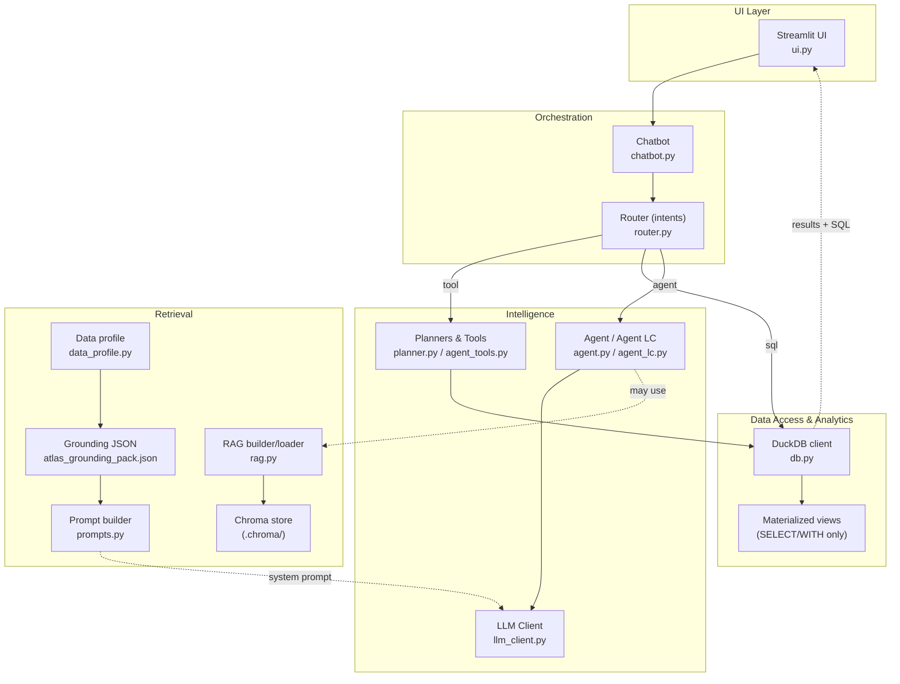
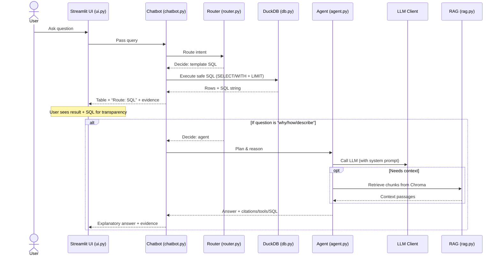

# AtlasBuilding Chatbot — Architecture & Flow

---

## 1) System Context (overview)
```mermaid
graph LR
    U["Users: Facility mgrs • Students • Researchers"]
    UI["Streamlit Chat UI\n(src/ui.py)"]
    C["Chatbot Coordinator\n(src/chatbot.py)"]
    R["NL Router (4 routes)\n(src/router.py)"]

    subgraph Data Tier
      DB["DuckDB (read‑only)\n(src/db.py)\n• Views over CSVs\n• Safety: SELECT/WITH+LIMIT"]
      CSV1["Atlas_occupancy_sensors_offices.csv"]
      CSV2["Atlas_occupancy_sensors_meeting_rooms.csv"]
      CSV3["sensor_space_data_occupancy.csv"]
      DB --> CSV1
      DB --> CSV2
      DB --> CSV3
    end

    subgraph Intelligence Tier
      direction TB
      LLM["LLM Client wrapper\n(src/llm_client.py)\n• OpenAI or Ollama (local)"]
      AG["Agent (heuristic / LC)\n(src/agent.py | src/agent_lc.py)"]
      TOOLS["Planner & Tools\n(src/planner.py | agent_tools.py)\n• e.g., Coffee/Toilet placement"]
      subgraph RAG
        direction TB
        CH["Chroma Vector Store\n(src/rag.py)"]
        GP["Grounding pack\n( atlas_grounding_pack.json )"]
        DP["Data profile builder\n(src/data_profile.py)"]
        PR["Prompt builder\n(src/prompts.py)"]
        DP --> GP
        CH --> PR
      end
      AG --> LLM
      AG -. may retrieve .-> CH
      AG -. may call .-> TOOLS
      AG -. may emit .->|Safe SQL| DB
    end

    U --> UI --> C --> R

    %% Routing branches
    R -->|1) tool| TOOLS --> DB
    R -->|2) sql (template)| DB
    R -->|3) agent| AG
    R -->|4) LLM routing| LLM

    %% Evidence back to UI
    DB -. results + SQL .-> UI
    AG -. answer + citations .-> UI
    TOOLS -. analytics .-> UI

    %% Future (optional)
    subgraph Future (dashed)
      style Future stroke-dasharray: 5 5
      PM["Predictive models\n(occupancy/energy)\nscikit‑learn / LSTM"]
    end
    PM -. planned .-> AG
```

**Notes**
- The router picks the lightest correct path: fast tools → template SQL → agent → LLM routing.
- All SQL is read‑only and safety‑checked. UI shows the SQL and a sample of rows as evidence.
- Agent can optionally use RAG for “why/how” explanations and call domain tools (e.g., placement planners).

---

## 2) Component Breakdown


---

## 3) Sequence — “Utilization by floor (last 30 days)”


---

## 4) Data & Safety Summary (for documentation)
- **Datasets**: `Atlas_occupancy_sensors_offices.csv`, `Atlas_occupancy_sensors_meeting_rooms.csv`, `sensor_space_data_occupancy.csv`.
- **Database**: DuckDB with read‑only helpers; only `SELECT/WITH` allowed + single statement + `LIMIT` enforced.
- **Routing**: tool → SQL → agent → LLM; prefer simpler/cheaper routes.
- **Explainability**: UI shows SQL and sample rows; agent can include citations from RAG.
- **Extensibility**: plug new tools/planners (e.g., free rooms, placement suggestions).
- **Models**: OpenAI or local (Ollama) via `llm_client.py`.
- **Grounding**: `data_profile.py` builds `atlas_grounding_pack.json`; `prompts.py` composes the system prompt.
- **Future work**: predictive models to forecast occupancy/energy.

